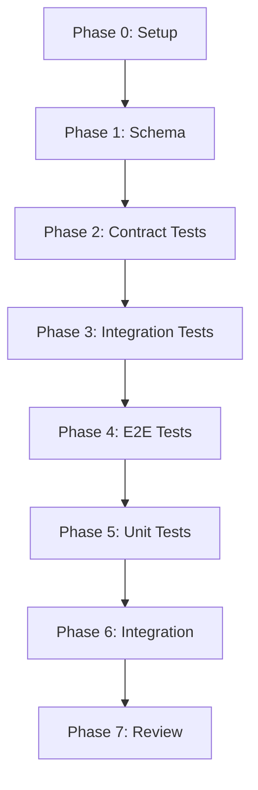

# [Feature Name] - Implementation Tasks

**Specification:** [link-to-spec.md]
**Plan:** [link-to-plan.md]
**Created:** YYYY-MM-DD
**Status:** 🚧 In Progress | ✅ Complete | ⏸️ Blocked

---

## Task Workflow Guidelines

### Execution Order

Tasks **MUST** follow this strict order (per Constitution Article IV):

1. **Contract Tests** - Define expected behavior
2. **Integration Tests** - Verify component interactions
3. **E2E Tests** - Validate full workflows
4. **Unit Tests** - Test isolated functions
5. **Implementation** - Write actual code

**RED → GREEN → Refactor cycle enforced**

### Task Dependencies

- `[P]` = Can run in parallel
- `[S]` = Must run sequentially (depends on previous)
- `[B]` = Currently blocked

---

## Phase 0: Setup & Planning

### Task 0.1: Constitutional Review ✅

**Owner:** [Name]
**Priority:** P0 (Blocking)
**Estimated:** 30 min

**Checklist:**
- [ ] Review `.specify/memory/constitution.md`
- [ ] Verify no constitutional violations in plan
- [ ] Document any necessary exceptions with justification
- [ ] Get approval from maintainers if exceptions needed

**Output:** Constitutional compliance sign-off

---

### Task 0.2: Development Environment Setup [P]

**Owner:** [Name]
**Priority:** P0
**Estimated:** 1 hour

**Checklist:**
- [ ] Create feature branch: `feature/[feature-name]`
- [ ] Update dependencies if needed: `npm install`
- [ ] Verify build works: `npm run build`
- [ ] Set up test environment

**Validation:**
```bash
npm run build && npm test
# All existing tests pass
```

---

## Phase 1: Contract & Schema Definition

### Task 1.1: Define Zod Schema [S]

**Owner:** [Name]
**Priority:** P0 (Foundation)
**Estimated:** 2 hours

**Checklist:**
- [ ] Create `src/[path]/[feature].ts`
- [ ] Define Zod schema with all parameters
- [ ] Add type inference: `export type Args = z.infer<typeof Schema>`
- [ ] Add JSDoc descriptions for AI agents
- [ ] Write schema validation tests

**Implementation:**
```typescript
// src/tools/ahk-feature.ts
import { z } from 'zod';

export const FeatureArgsSchema = z.object({
  // TODO: Define schema
});

export type FeatureArgs = z.infer<typeof FeatureArgsSchema>;
```

**Tests (Write BEFORE implementation):**
```typescript
// tests/tools/ahk-feature.test.ts
describe('FeatureArgsSchema', () => {
  it('validates correct input', () => {
    const result = FeatureArgsSchema.safeParse({
      // valid input
    });
    expect(result.success).toBe(true);
  });

  it('rejects invalid input', () => {
    const result = FeatureArgsSchema.safeParse({
      // invalid input
    });
    expect(result.success).toBe(false);
  });
});
```

**Validation:**
- [ ] Schema tests written and FAIL (RED)
- [ ] Schema implemented to make tests PASS (GREEN)
- [ ] Code reviewed for edge cases (Refactor)

---

### Task 1.2: Define MCP Tool Definition [S]

**Owner:** [Name]
**Priority:** P0
**Estimated:** 1 hour

**Checklist:**
- [ ] Create `toolDefinition` export
- [ ] Write AI-optimized description (focus on USE CASE)
- [ ] Map Zod schema to JSON Schema for `inputSchema`
- [ ] Follow `AHK_Category_Action` naming convention

**Implementation:**
```typescript
export const featureToolDefinition = {
  name: 'AHK_[Category]_[Action]',
  description: `
    [1-2 sentence purpose - WHAT it does]

    Use this when: [specific use case]
    Returns: [what the response contains]
  `,
  inputSchema: {
    type: 'object',
    properties: {
      // Derived from Zod schema
    },
    required: [/* required fields */]
  }
};
```

**Validation:**
- [ ] Tool name follows naming convention
- [ ] Description optimized for AI agent selection
- [ ] Input schema matches Zod schema exactly

---

## Phase 2: Contract Tests (Write Tests FIRST)

### Task 2.1: Write Contract Tests [S]

**Owner:** [Name]
**Priority:** P0
**Estimated:** 3 hours

**Checklist:**
- [ ] Define expected tool behavior in tests
- [ ] Test success scenarios
- [ ] Test error scenarios
- [ ] Test edge cases
- [ ] Verify tests FAIL (no implementation yet)

**Tests (These define the contract):**
```typescript
describe('AHK_Feature_Tool Contract', () => {
  it('returns success response for valid input', async () => {
    const tool = new FeatureTool();
    const result = await tool.execute({
      // valid input
    });

    expect(result.content[0].text).toContain('Success');
    expect(result.isError).toBe(false);
  });

  it('returns error with isError flag for invalid input', async () => {
    const tool = new FeatureTool();
    const result = await tool.execute({
      // invalid input
    });

    expect(result.isError).toBe(true);
    expect(result.content[0].text).toContain('Error:');
  });

  it('handles edge case: [specific scenario]', async () => {
    // Edge case test
  });
});
```

**Validation:**
- [ ] All tests written and FAIL (RED)
- [ ] Tests cover happy path, errors, edge cases
- [ ] Test expectations clear and measurable

---

### Task 2.2: Implement Minimal Tool Class [S]

**Owner:** [Name]
**Priority:** P0
**Estimated:** 2 hours

**Checklist:**
- [ ] Create tool class implementing contract
- [ ] Add Zod validation in execute()
- [ ] Return MCP-compliant responses
- [ ] Include `isError: true` for errors
- [ ] Make contract tests PASS

**Implementation:**
```typescript
export class FeatureTool {
  async execute(args: unknown): Promise<MCPResponse> {
    try {
      // Validate
      const parsed = FeatureArgsSchema.parse(args);

      // Execute (minimal implementation to pass tests)
      const result = await this.doFeatureWork(parsed);

      return {
        content: [{ type: 'text', text: JSON.stringify(result) }],
        isError: false
      };
    } catch (error) {
      logger.error('Feature tool error:', error);
      return {
        content: [{
          type: 'text',
          text: `❌ Error: ${error.message}`
        }],
        isError: true
      };
    }
  }

  private async doFeatureWork(args: FeatureArgs): Promise<any> {
    // Minimal implementation
    throw new Error('Not implemented');
  }
}
```

**Validation:**
- [ ] Contract tests now PASS (GREEN)
- [ ] MCP response format correct
- [ ] Error handling with isError flag working

---

## Phase 3: Integration Tests

### Task 3.1: Write Integration Tests [S]

**Owner:** [Name]
**Priority:** P1
**Estimated:** 3 hours

**Checklist:**
- [ ] Test integration with existing core services
- [ ] Test file system operations (if applicable)
- [ ] Test process management (if applicable)
- [ ] Test active file integration (if applicable)
- [ ] Verify tests FAIL before implementation

**Tests:**
```typescript
describe('Feature Integration', () => {
  it('integrates with active file manager', async () => {
    // Set active file
    activeFile.setActiveFile('test.ahk');

    // Tool should use active file
    const tool = new FeatureTool();
    const result = await tool.execute({
      // no filePath provided
    });

    expect(result.content[0].text).toContain('test.ahk');
  });

  it('integrates with [other service]', async () => {
    // Integration test
  });
});
```

**Validation:**
- [ ] Integration tests written and FAIL (RED)
- [ ] Tests cover all integration points
- [ ] Test data cleanup handled

---

### Task 3.2: Implement Core Logic [S]

**Owner:** [Name]
**Priority:** P1
**Estimated:** 4 hours

**Checklist:**
- [ ] Implement business logic
- [ ] Integrate with active file manager (if needed)
- [ ] Integrate with other core services
- [ ] Add proper error handling
- [ ] Make integration tests PASS

**Implementation:**
```typescript
private async doFeatureWork(args: FeatureArgs): Promise<FeatureResult> {
  // Resolve file path (use active file if not provided)
  const filePath = resolveAndValidateFilePath(args.filePath);

  // Business logic
  const result = await this.executeBusinessLogic(filePath, args);

  return result;
}
```

**Validation:**
- [ ] Integration tests now PASS (GREEN)
- [ ] Core logic complete
- [ ] Error handling comprehensive

---

## Phase 4: E2E Tests

### Task 4.1: Write E2E Tests [S]

**Owner:** [Name]
**Priority:** P1
**Estimated:** 2 hours

**Checklist:**
- [ ] Test full MCP workflow (client → server → response)
- [ ] Test multi-turn conversations
- [ ] Test error recovery
- [ ] Verify tests FAIL before full implementation

**Tests:**
```typescript
describe('Feature E2E', () => {
  it('completes full user workflow', async () => {
    const client = new MCPClient(transport);

    // Turn 1
    const r1 = await client.callTool('AHK_Feature_Tool', {
      requiredParam: 'start'
    });
    expect(r1.content[0].text).toContain('Success');

    // Turn 2 (uses context from turn 1)
    const r2 = await client.callTool('AHK_Feature_Tool', {
      requiredParam: 'continue'
    });
    expect(r2.content[0].text).toContain('Completed');
  });

  it('recovers from errors gracefully', async () => {
    // Error recovery test
  });
});
```

**Validation:**
- [ ] E2E tests written and FAIL (RED)
- [ ] Tests cover realistic user scenarios

---

### Task 4.2: Complete E2E Implementation [S]

**Owner:** [Name]
**Priority:** P1
**Estimated:** 2 hours

**Checklist:**
- [ ] Ensure full workflow works end-to-end
- [ ] Add any missing error handling
- [ ] Add progress logging
- [ ] Make E2E tests PASS

**Validation:**
- [ ] E2E tests now PASS (GREEN)
- [ ] Full user workflows complete
- [ ] Error recovery works

---

## Phase 5: Unit Tests & Refinement

### Task 5.1: Write Unit Tests [P]

**Owner:** [Name]
**Priority:** P2
**Estimated:** 2 hours

**Checklist:**
- [ ] Test isolated helper functions
- [ ] Test data transformations
- [ ] Test validation logic
- [ ] Test edge cases

**Tests:**
```typescript
describe('Feature Helpers', () => {
  it('transforms data correctly', () => {
    const input = { /* test data */ };
    const output = transformData(input);
    expect(output).toEqual(expectedOutput);
  });

  it('validates edge case: empty input', () => {
    expect(() => validateInput(null)).toThrow();
  });
});
```

**Validation:**
- [ ] Unit tests cover all helper functions
- [ ] Edge cases handled

---

### Task 5.2: Refactor for Quality [S]

**Owner:** [Name]
**Priority:** P2
**Estimated:** 2 hours

**Checklist:**
- [ ] Extract reusable functions
- [ ] Improve error messages
- [ ] Add JSDoc comments
- [ ] Optimize performance hot paths
- [ ] Ensure all tests still PASS

**Validation:**
- [ ] Code is DRY (no duplication)
- [ ] Error messages clear and actionable
- [ ] Performance meets targets
- [ ] All tests GREEN

---

## Phase 6: Integration & Documentation

### Task 6.1: Register Tool in Server [S]

**Owner:** [Name]
**Priority:** P1
**Estimated:** 30 min

**Checklist:**
- [ ] Import tool in `src/server.ts`
- [ ] Add to tool list
- [ ] Add switch case handler
- [ ] Test tool registration

**Implementation:**
```typescript
// src/server.ts
import { FeatureTool, featureToolDefinition } from './tools/ahk-feature.js';

// Register tool
server.setRequestHandler(ListToolsRequestSchema, async () => ({
  tools: [
    // ... existing tools
    featureToolDefinition
  ]
}));

// Handle tool calls
server.setRequestHandler(CallToolRequestSchema, async (request) => {
  switch (request.params.name) {
    // ... existing cases
    case 'AHK_Feature_Tool':
      const tool = new FeatureTool();
      return await tool.execute(request.params.arguments);
  }
});
```

**Validation:**
- [ ] Tool appears in tool list
- [ ] Tool can be called via MCP
- [ ] No breaking changes to other tools

---

### Task 6.2: Update Documentation [P]

**Owner:** [Name]
**Priority:** P1
**Estimated:** 2 hours

**Checklist:**
- [ ] Update `README.md` with new tool
- [ ] Add usage examples to relevant guide
- [ ] Update `RELEASE_NOTES.md`
- [ ] Update `.specify/specs/ahk-mcp-master-spec.md`
- [ ] Add to constitution if new principles introduced

**Documentation Locations:**
```
README.md
  → Add to tool list
  → Add to features section

docs/[relevant-guide].md
  → Add usage examples
  → Add integration patterns

RELEASE_NOTES.md
  → Add to "New Features" section

.specify/specs/ahk-mcp-master-spec.md
  → Update functional requirements
  → Update tool count
```

**Validation:**
- [ ] Documentation complete and accurate
- [ ] Examples tested and working
- [ ] Links not broken

---

### Task 6.3: Performance Testing [S]

**Owner:** [Name]
**Priority:** P2
**Estimated:** 1 hour

**Checklist:**
- [ ] Run performance benchmarks
- [ ] Verify meets SLA targets
- [ ] Check memory usage under load
- [ ] Profile for bottlenecks

**Benchmarks:**
```typescript
describe('Performance', () => {
  it('completes within 500ms', async () => {
    const start = Date.now();
    await tool.execute(params);
    const duration = Date.now() - start;

    expect(duration).toBeLessThan(500);
  });

  it('handles 1000 calls without memory leak', async () => {
    const initialMemory = process.memoryUsage().heapUsed;

    for (let i = 0; i < 1000; i++) {
      await tool.execute(params);
    }

    const finalMemory = process.memoryUsage().heapUsed;
    const growth = finalMemory - initialMemory;

    expect(growth).toBeLessThan(10 * 1024 * 1024); // <10MB
  });
});
```

**Validation:**
- [ ] Performance meets all targets
- [ ] No memory leaks detected
- [ ] Bottlenecks identified and addressed

---

## Phase 7: Review & Release

### Task 7.1: Code Review [S]

**Owner:** [Reviewer Name]
**Priority:** P0 (Blocking)
**Estimated:** 1 hour

**Checklist:**
- [ ] Constitutional compliance verified
- [ ] Code follows project patterns
- [ ] Tests comprehensive (>80% coverage)
- [ ] Error handling complete
- [ ] Documentation accurate
- [ ] Performance acceptable

**Review Criteria:**
- Type safety: TypeScript strict mode + Zod
- MCP compliance: Correct response format + isError flag
- Security: Path validation + case-insensitive checks
- Testing: RED-GREEN-Refactor followed
- Naming: AHK_Category_Action convention

---

### Task 7.2: Final Integration Test [S]

**Owner:** [Name]
**Priority:** P0 (Blocking)
**Estimated:** 30 min

**Checklist:**
- [ ] Build succeeds: `npm run build`
- [ ] All tests pass: `npm test`
- [ ] No TypeScript errors
- [ ] No linting errors
- [ ] Tool works in real MCP client (Claude Desktop/Code)

**Validation Commands:**
```bash
# Build
npm run build

# Test
npm test

# Lint
npm run lint

# Manual test with MCP inspector
npx @modelcontextprotocol/inspector dist/server.js
```

---

### Task 7.3: Create Pull Request [S]

**Owner:** [Name]
**Priority:** P0
**Estimated:** 30 min

**Checklist:**
- [ ] Create PR from feature branch to main
- [ ] Fill out PR template
- [ ] Link to spec and plan documents
- [ ] Add screenshots/demos if applicable
- [ ] Request review from maintainers

**PR Description Template:**
```markdown
## Summary
[Brief description of feature]

## Specification
- Spec: .specify/specs/[feature-spec.md]
- Plan: .specify/specs/[feature-plan.md]

## Changes
- [ ] New tool: AHK_Feature_Tool
- [ ] Updated tools: [list]
- [ ] New dependencies: [list or "None"]

## Testing
- [ ] Unit tests: X tests added
- [ ] Integration tests: X tests added
- [ ] E2E tests: X tests added
- [ ] Manual testing: [describe]

## Constitutional Compliance
- [X] All articles reviewed
- [X] No violations or documented exceptions

## Performance
- Response time: XXms (target: 500ms)
- Memory usage: stable
- Test coverage: XX%

## Documentation
- [ ] README.md updated
- [ ] Guide updated: [which one]
- [ ] RELEASE_NOTES.md updated
- [ ] Spec updated

## Checklist
- [ ] Build succeeds
- [ ] All tests pass
- [ ] No linting errors
- [ ] Tested in real MCP client
- [ ] Documentation complete
```

---

## Task Summary

### Total Effort Estimate

| Phase | Tasks | Estimated Time |
|-------|-------|---------------|
| Phase 0: Setup | 2 | 1.5 hours |
| Phase 1: Schema | 2 | 3 hours |
| Phase 2: Contract Tests | 2 | 5 hours |
| Phase 3: Integration Tests | 2 | 7 hours |
| Phase 4: E2E Tests | 2 | 4 hours |
| Phase 5: Unit Tests | 2 | 4 hours |
| Phase 6: Integration | 3 | 3.5 hours |
| Phase 7: Review | 3 | 2 hours |
| **Total** | **18** | **30 hours** |

---

## Dependencies



---

## Risk Tracking

| Risk | Status | Mitigation |
|------|--------|-----------|
| [Risk description] | 🟢 Low / 🟡 Med / 🔴 High | [Action taken] |

---

## Progress Tracking

### Daily Standup Updates

**YYYY-MM-DD:**
- Completed: [tasks]
- In progress: [tasks]
- Blocked: [tasks with blocker description]
- Next: [upcoming tasks]

---

## Retrospective (Post-Completion)

### What Went Well
- [Success]
- [Success]

### What Could Improve
- [Lesson learned]
- [Lesson learned]

### Action Items for Next Feature
- [ ] [Improvement to implement]
- [ ] [Process change]

---

*This task breakdown follows the constitutional requirement of Test-First Development (Article IV). Implementation code is NEVER written before tests.*
